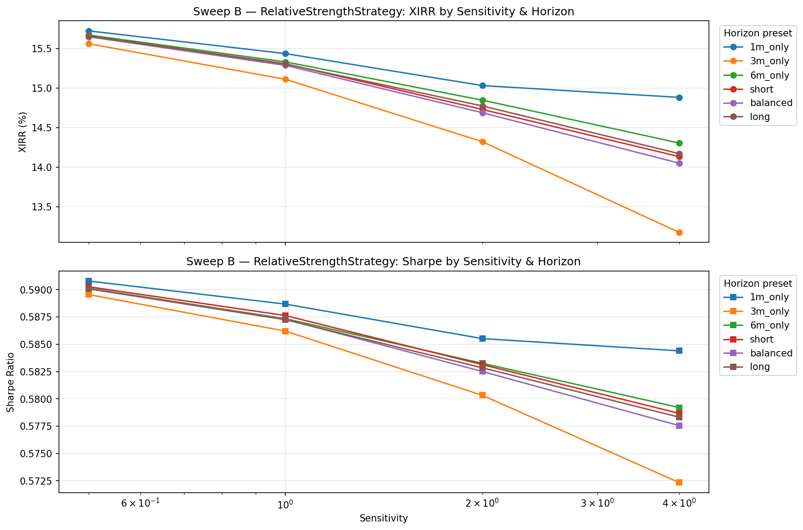
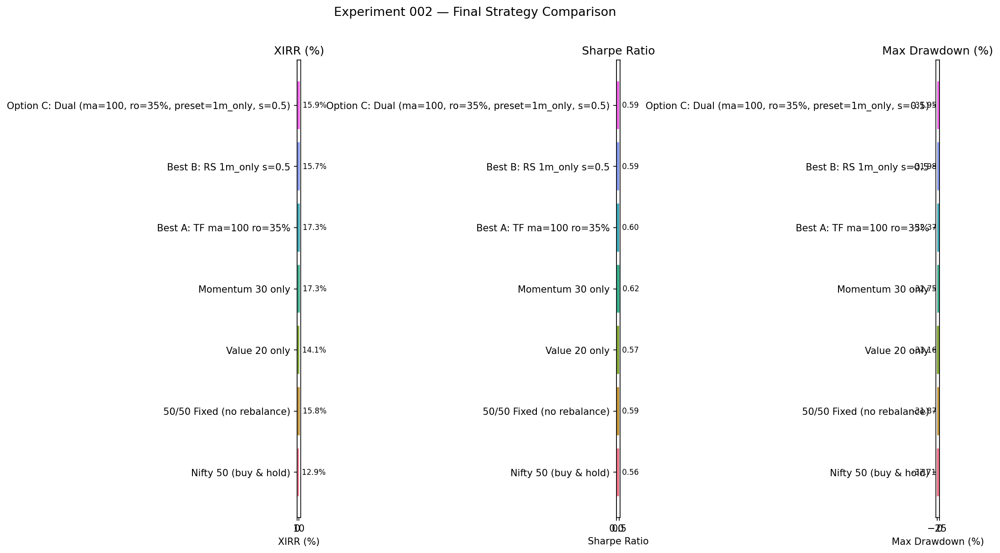
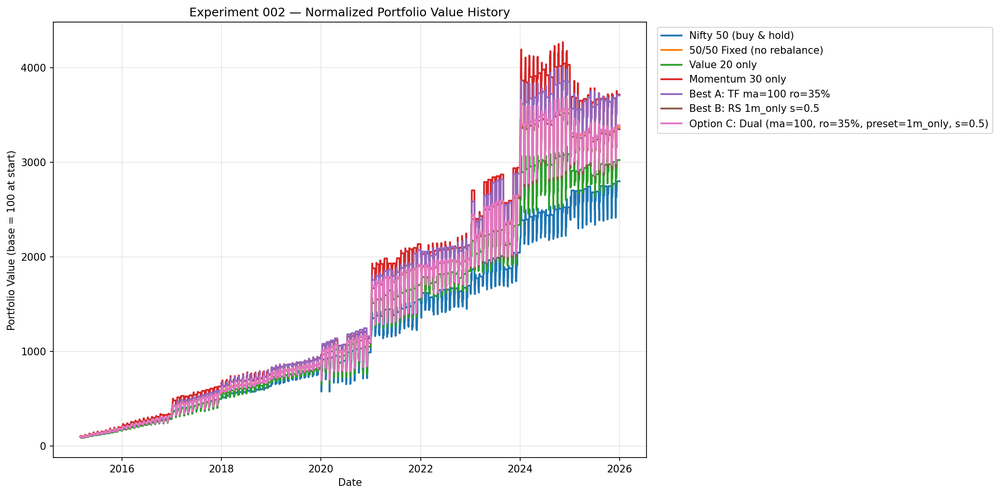
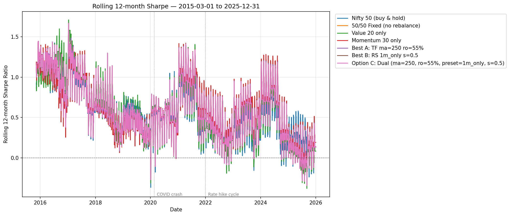
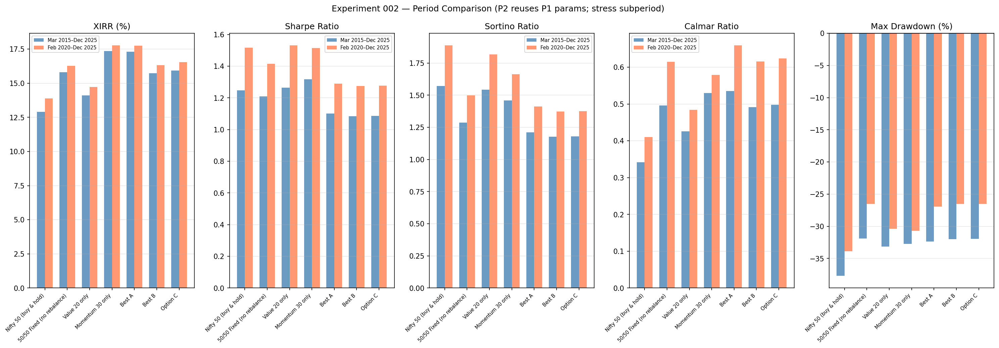

# Experiment 002 — Adaptive Factor Rotation

## 1. Experiment Setup

| Parameter | Value |
|---|---|
| Period (P1 sweep) | 2015-03-01 → 2025-12-31 |
| Period (P2 stress) | 2020-02-01 → 2025-12-31 |
| Initial Investment | ₹100,000 |
| Monthly SIP | ₹10,000 |
| Value Fund | Nifty50 Value 20 |
| Momentum Fund | NIFTY200MOMENTM30 |
| Trend Reference | Nifty 50 |

---

## 2. Sweep A — TrendFilterStrategy

**Parameters swept:**
- MA Window: [50, 100, 150, 200, 250, 300, 350, 400, 500]
- Risk-on Momentum Weight: ['35%', '40%', '45%', '50%', '55%', '65%', '75%', '85%']
  (Risk-off weight = 1 − risk_on_weight, symmetric)

**Total runs:** 72
**Best selected by:** highest XIRR

### Top-5 by XIRR

| MA Window | Risk-on Weight | Risk-off Weight | XIRR | Sharpe | Max DD |
| --- | --- | --- | --- | --- | --- |
| 100 | 35% | 65% | 17.31% | 0.601 | -32.37% |
| 50 | 35% | 65% | 17.31% | 0.603 | -32.37% |
| 150 | 35% | 65% | 17.27% | 0.600 | -32.38% |
| 200 | 35% | 65% | 17.17% | 0.599 | -32.38% |
| 400 | 85% | 15% | 17.01% | 0.610 | -31.08% |

### Heatmap

---

## 3. Sweep B — RelativeStrengthStrategy

**Horizon presets:**
- `1m_only`: {30: 1.0}
- `3m_only`: {90: 1.0}
- `6m_only`: {180: 1.0}
- `short`: {30: 0.5, 90: 0.35, 180: 0.15}
- `balanced`: {30: 0.2, 90: 0.3, 180: 0.5}
- `long`: {30: 0.05, 90: 0.15, 180: 0.8}

**Sensitivities:** [0.5, 1.0, 2.0, 4.0]
**Total runs:** 24
**Best selected by:** highest Sharpe Ratio

### Top-5 by Sharpe

| Horizon Preset | Sensitivity | XIRR | Sharpe | Max DD |
| --- | --- | --- | --- | --- |
| 1m_only | 0.5 | 15.72% | 0.591 | -31.98% |
| short | 0.5 | 15.66% | 0.590 | -31.93% |
| 6m_only | 0.5 | 15.67% | 0.590 | -31.89% |
| balanced | 0.5 | 15.65% | 0.590 | -31.91% |
| long | 0.5 | 15.66% | 0.590 | -31.89% |

### Grid Chart

---

## 4. Best Parameters Identified

### Option A (TrendFilter)
- **MA Window:** 100
- **Risk-on momentum weight:** 35%
- **Risk-off momentum weight:** 65%
- **XIRR:** 17.31%

### Option B (RelativeStrength)
- **Horizon preset:** `1m_only`
- **Sensitivity:** 0.5
- **Sharpe Ratio:** 0.591

---

## 5. Option C — DualSignalStrategy

Combines best A params (ma_window=100, risk_on_m_weight=0.35)
with best B params (horizon_preset=`1m_only`, sensitivity=0.5).

Agreement logic:
- Both risk-on **and** RS ≥ 0.5 → amplify momentum (tilt higher)
- Both risk-off **and** RS < 0.5 → amplify value (tilt lower)
- Disagree → neutral (50/50)

---

## 6. Final Comparison — All Strategies

| Strategy | Total Invested | Final Value | XIRR | Sharpe | Sortino | Calmar | Max DD |
| --- | --- | --- | --- | --- | --- | --- | --- |
| Nifty 50 (buy & hold) | ₹1,399,967 | ₹3,078,478 | 12.89% | 0.561 | 0.754 | 0.342 | -37.71% |
| 50/50 Fixed (no rebalance) | ₹1,399,967 | ₹3,705,358 | 15.82% | 0.592 | 0.734 | 0.496 | -31.87% |
| Value 20 only | ₹1,399,967 | ₹3,324,865 | 14.11% | 0.570 | 0.759 | 0.425 | -33.16% |
| Momentum 30 only | ₹1,399,967 | ₹4,085,852 | 17.35% | 0.619 | 0.774 | 0.530 | -32.75% |
| Best A: TF ma=100 ro=35% | ₹1,399,617 | ₹4,076,477 | 17.31% | 0.601 | 0.754 | 0.535 | -32.37% |
| Best B: RS 1m_only s=0.5 | ₹1,399,771 | ₹3,683,291 | 15.72% | 0.591 | 0.733 | 0.492 | -31.98% |
| Option C: Dual (ma=100, ro=35%, preset=1m_only, s=0.5) | ₹1,399,851 | ₹3,728,946 | 15.92% | 0.592 | 0.735 | 0.498 | -31.95% |

---

## 7. Portfolio Value History

---

## 8. Rolling 12-month Sharpe (Period 1)

Shows consistency of risk-adjusted returns over time. Periods near zero or negative
indicate stretches where the strategy was destroying risk-adjusted value.

---

## 9. Period 2 — COVID Stress Test (Feb 2020 → Dec 2025)

Strategies use the **same parameters** found in Period 1 sweeps (out-of-sample).
Initial ₹100,000 + ₹10,000/month from 2020-02-01.

| Strategy | XIRR | Sharpe | Sortino | Calmar | Max DD | Total Return |
| --- | --- | --- | --- | --- | --- | --- |
| Nifty 50 (buy & hold) | 13.89% | 0.704 | 0.948 | 0.410 | -33.88% | 59.37% |
| 50/50 Fixed (no rebalance) | 16.28% | 0.711 | 0.880 | 0.614 | -26.49% | 72.57% |
| Value 20 only | 14.72% | 0.711 | 0.926 | 0.484 | -30.39% | 63.84% |
| Momentum 30 only | 17.76% | 0.726 | 0.899 | 0.579 | -30.67% | 81.30% |
| Best A: TF ma=100 ro=35% | 17.74% | 0.720 | 0.899 | 0.659 | -26.91% | 81.16% |
| Best B: RS 1m_only s=0.5 | 16.33% | 0.712 | 0.879 | 0.616 | -26.52% | 72.87% |
| Option C: Dual (ma=100, ro=35%, preset=1m_only, s=0.5) | 16.53% | 0.713 | 0.881 | 0.624 | -26.49% | 74.05% |

---

## 10. Key Conclusions

- **Sweep A** tests whether a simple SMA trend filter helps time value/momentum tilts.
  The best-performing MA window and risk-on weight are selected by maximum XIRR.
- **Sweep B** tests whether multi-horizon relative strength improves risk-adjusted returns.
  The best preset and sensitivity are selected by maximum Sharpe Ratio.
- **Option C** combines both signals: when they agree the tilt is amplified; when they
  disagree the portfolio reverts to a neutral 50/50 blend.
- All three adaptive strategies are compared against four baselines covering the full
  factor spectrum (Nifty 50, pure value, pure momentum, 50/50 blend).
