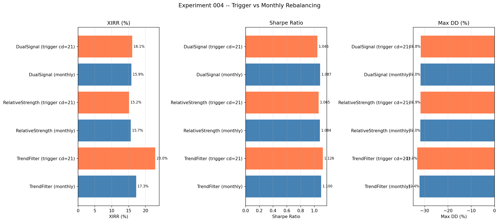
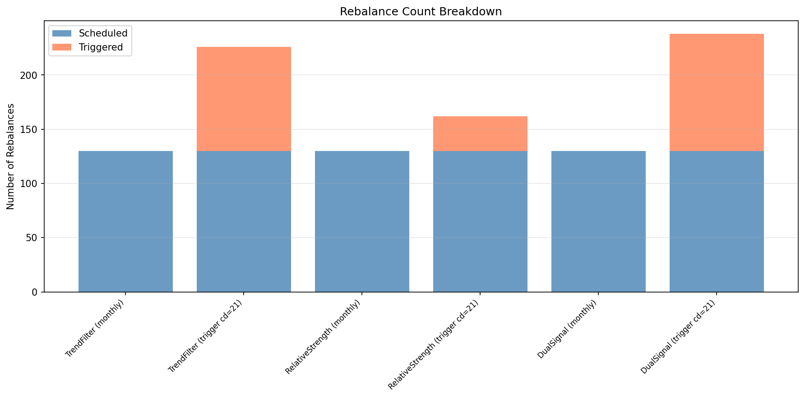
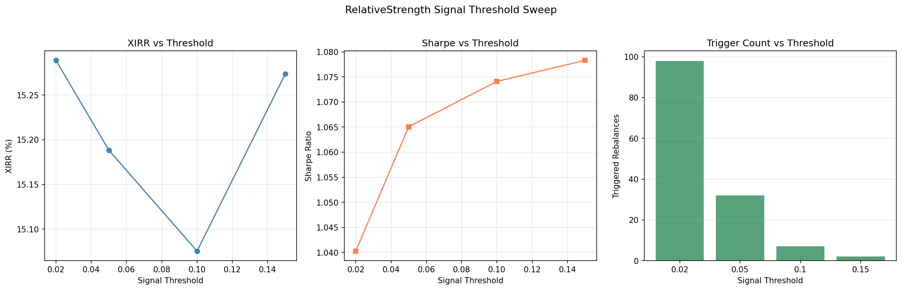
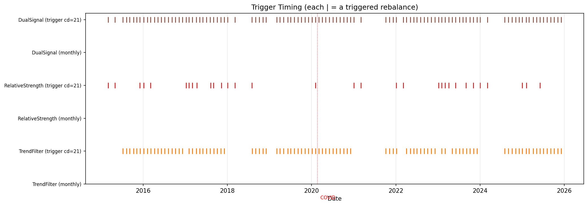
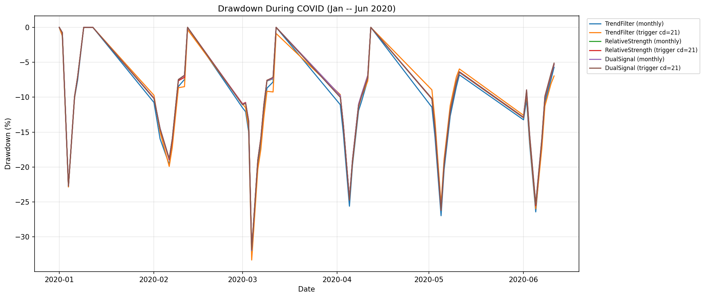

# Experiment 004 -- Trigger-Based Rebalancing

## 1. Purpose

Test whether daily signal checking with cooldown-gated mid-month
rebalancing improves adaptive strategy performance vs monthly-only
rebalancing.

## 2. Setup

| Parameter | Value |
|---|---|
| Period (P1) | 2015-03-01 -> 2025-12-31 |
| Period (P2 stress) | 2020-02-01 -> 2025-12-31 |
| Initial Investment | INR 100,000 |
| Monthly SIP | INR 10,000 |
| TrendFilter params | ma=100, risk_on=35% |
| RelativeStrength params | 1m_only, sensitivity=0.5 |
| Data Source | NSE PR index data |

---

## 3. Baselines

| Strategy | XIRR | Sharpe | Sortino | Calmar | Max DD | Sched | Trig | Total |
| --- | --- | --- | --- | --- | --- | --- | --- | --- |
| Nifty 50 (buy & hold) | 12.89% | 1.247 | 1.572 | 0.342 | -37.71% | 130 | 0 | 130 |
| 50/50 Fixed (no rebalance) | 15.82% | 1.209 | 1.286 | 0.496 | -31.87% | 130 | 0 | 130 |
| Value 20 only | 14.11% | 1.265 | 1.543 | 0.425 | -33.16% | 130 | 0 | 130 |
| Momentum 30 only | 17.35% | 1.318 | 1.458 | 0.530 | -32.75% | 130 | 0 | 130 |

---

## 4. Trigger vs Monthly Comparison

| Strategy | XIRR | Sharpe | Sortino | Calmar | Max DD | Sched | Trig | Total |
| --- | --- | --- | --- | --- | --- | --- | --- | --- |
| TrendFilter (monthly) | 17.31% | 1.100 | 1.211 | 0.535 | -32.37% | 130 | 0 | 130 |
| TrendFilter (trigger cd=21) | 22.96% | 1.126 | 1.271 | 0.689 | -33.31% | 130 | 96 | 226 |
| RelativeStrength (monthly) | 15.72% | 1.084 | 1.177 | 0.492 | -31.98% | 130 | 0 | 130 |
| RelativeStrength (trigger cd=21) | 15.19% | 1.065 | 1.159 | 0.476 | -31.89% | 130 | 32 | 162 |
| DualSignal (monthly) | 15.92% | 1.087 | 1.179 | 0.498 | -31.95% | 130 | 0 | 130 |
| DualSignal (trigger cd=21) | 16.12% | 1.046 | 1.147 | 0.506 | -31.83% | 130 | 108 | 238 |

---

## 5. Cooldown Sweep (TrendFilter)

Cooldown values tested: [5, 10, 15, 21, 30, 42, 63]

| Cooldown | Strategy | XIRR | Sharpe | Sortino | Calmar | Max DD | Sched | Trig | Total |
| --- | --- | --- | --- | --- | --- | --- | --- | --- | --- |
| 5 | TF cd=5 | 22.90% | 1.106 | 1.259 | 0.679 | -33.72% | 130 | 143 | 273 |
| 10 | TF cd=10 | 23.21% | 1.128 | 1.273 | 0.697 | -33.31% | 130 | 99 | 229 |
| 15 | TF cd=15 | 22.96% | 1.126 | 1.271 | 0.689 | -33.31% | 130 | 96 | 226 |
| 21 | TF cd=21 | 22.96% | 1.126 | 1.271 | 0.689 | -33.31% | 130 | 96 | 226 |
| 30 | TF cd=30 | 25.93% | 1.162 | 1.311 | 0.788 | -32.89% | 130 | 92 | 222 |
| 42 | TF cd=42 | 19.67% | 1.107 | 1.229 | 0.583 | -33.73% | 130 | 50 | 180 |
| 63 | TF cd=63 | 21.89% | 1.134 | 1.262 | 0.686 | -31.92% | 130 | 44 | 174 |

---

## 6. Signal Threshold Sweep (RelativeStrength)

Thresholds tested: [0.02, 0.05, 0.1, 0.15]

| Threshold | Strategy | XIRR | Sharpe | Sortino | Calmar | Max DD | Sched | Trig | Total |
| --- | --- | --- | --- | --- | --- | --- | --- | --- | --- |
| 0.02 | RS thresh=0.02 | 15.29% | 1.040 | 1.141 | 0.479 | -31.89% | 130 | 98 | 228 |
| 0.05 | RS thresh=0.05 | 15.19% | 1.065 | 1.159 | 0.476 | -31.89% | 130 | 32 | 162 |
| 0.1 | RS thresh=0.1 | 15.08% | 1.074 | 1.166 | 0.472 | -31.97% | 130 | 7 | 137 |
| 0.15 | RS thresh=0.15 | 15.27% | 1.078 | 1.171 | 0.478 | -31.97% | 130 | 2 | 132 |

---

## 7. Trigger Timing

---

## 8. Drawdown During COVID

